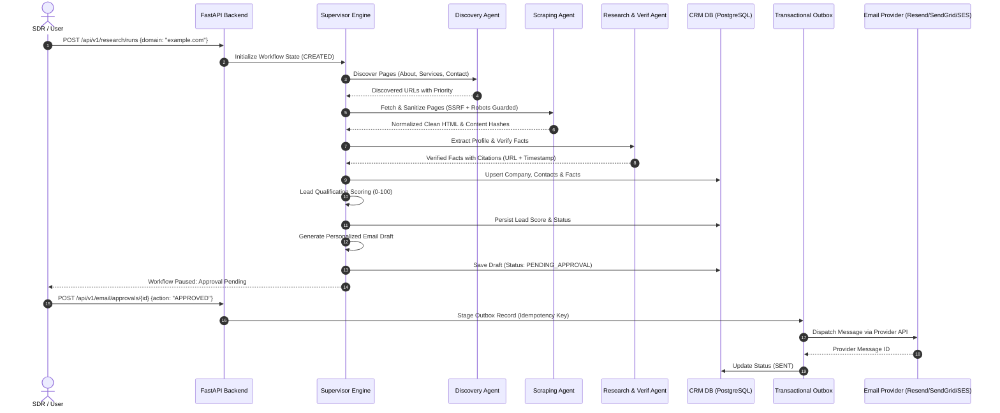
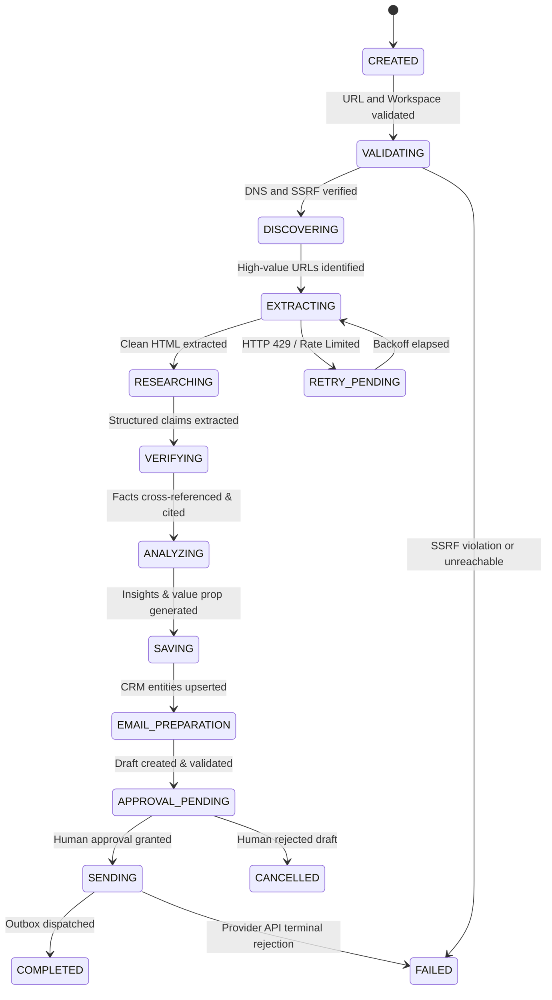

# Workflow Sequence and State Machine Diagrams

### 1. End-to-End Workflow Sequence

```mermaid
sequenceDiagram
    autonumber
    actor User as SDR / User
    participant API as FastAPI Backend
    participant Sup as Supervisor Engine
    participant Disc as Discovery Agent
    participant Scrp as Scraping Agent
    participant Res as Research & Verif Agent
    participant CRM as CRM DB (PostgreSQL)
    participant Outbox as Transactional Outbox
    participant Email as Email Provider (Resend/SendGrid/SES)

    User->>API: POST /api/v1/research/runs {domain: "example.com"}
    API->>Sup: Initialize Workflow State (CREATED)
    Sup->>Disc: Discover Pages (About, Services, Contact)
    Disc-->>Sup: Discovered URLs with Priority
    Sup->>Scrp: Fetch & Sanitize Pages (SSRF + Robots Guarded)
    Scrp-->>Sup: Normalized Clean HTML & Content Hashes
    Sup->>Res: Extract Profile & Verify Facts
    Res-->>Sup: Verified Facts with Citations (URL + Timestamp)
    Sup->>CRM: Upsert Company, Contacts & Facts
    Sup->>Sup: Lead Qualification Scoring (0-100)
    Sup->>CRM: Persist Lead Score & Status
    Sup->>Sup: Generate Personalized Email Draft
    Sup->>CRM: Save Draft (Status: PENDING_APPROVAL)
    Sup-->>User: Workflow Paused: Approval Pending

    User->>API: POST /api/v1/email/approvals/{id} {action: "APPROVED"}
    API->>Outbox: Stage Outbox Record (Idempotency Key)
    Outbox->>Email: Dispatch Message via Provider API
    Email-->>Outbox: Provider Message ID
    Outbox->>CRM: Update Status (SENT)
```

---

### 2. Supervisor State Machine Transitions

```mermaid
stateDiagram-v2
    [*] --> CREATED
    CREATED --> VALIDATING: URL and Workspace validated
    VALIDATING --> DISCOVERING: DNS and SSRF verified
    DISCOVERING --> EXTRACTING: High-value URLs identified
    EXTRACTING --> RESEARCHING: Clean HTML extracted
    RESEARCHING --> VERIFYING: Structured claims extracted
    VERIFYING --> ANALYZING: Facts cross-referenced & cited
    ANALYZING --> SAVING: Insights & value prop generated
    SAVING --> EMAIL_PREPARATION: CRM entities upserted
    EMAIL_PREPARATION --> APPROVAL_PENDING: Draft created & validated
    APPROVAL_PENDING --> SENDING: Human approval granted
    SENDING --> COMPLETED: Outbox dispatched
    
    VALIDATING --> FAILED: SSRF violation or unreachable
    EXTRACTING --> RETRY_PENDING: HTTP 429 / Rate Limited
    RETRY_PENDING --> EXTRACTING: Backoff elapsed
    APPROVAL_PENDING --> CANCELLED: Human rejected draft
    SENDING --> FAILED: Provider API terminal rejection
```
